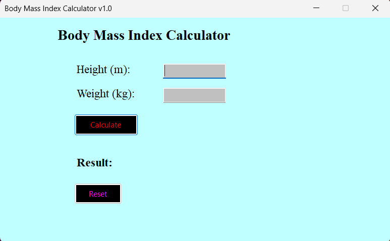

# BMI Calculator (Windows Forms)

A simple, user-friendly desktop application built with **C#** and **.NET Windows Forms** to calculate Body Mass Index (BMI).

It categorizes the result (Underweight, Normal, Overweight, Obese) based on WHO standards and provides color-coded visual feedback.

## 🚀 Features

* **Instant Calculation:** Calculates BMI accurately using metric units (kg/m).
* **Visual Status:** Changes text color based on the result (e.g., Green for Normal, Red for Obese).
* **Input Validation:** Prevents crashes by blocking non-numeric inputs.
* **User Friendly:**
    * `Enter` key triggers calculation.
    * `Focus` management for quick typing.
* **Keyboard Shortcuts:**
    * `F5`: Reset the form.
    * `Esc`: Exit the application.

## 🛠️ Built With

* C#
* .NET Framework
* Windows Forms (WinForms)
* Visual Studio

## 💻 How to Run

1.  Clone this repository.
2.  Open the solution file (`.sln`) in **Visual Studio**.
3.  Press **Start** or `F5` to build and run the application.